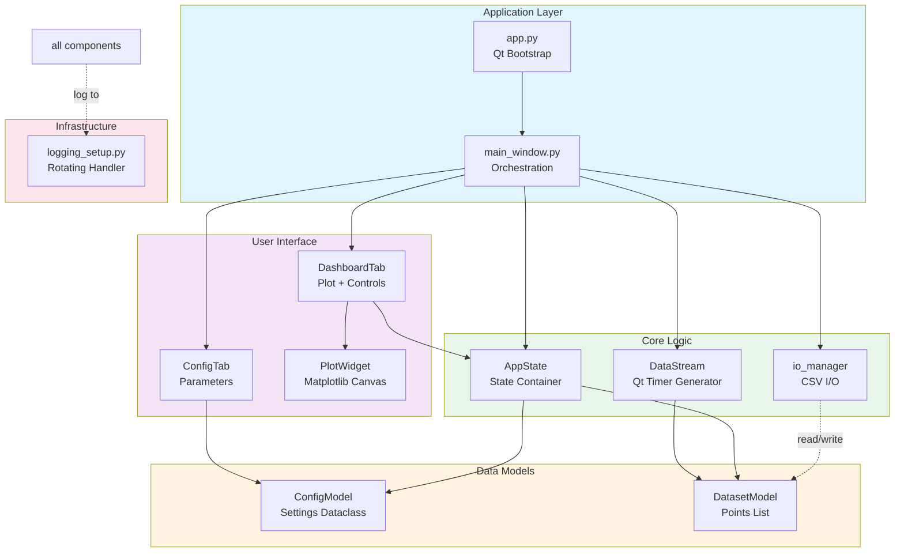
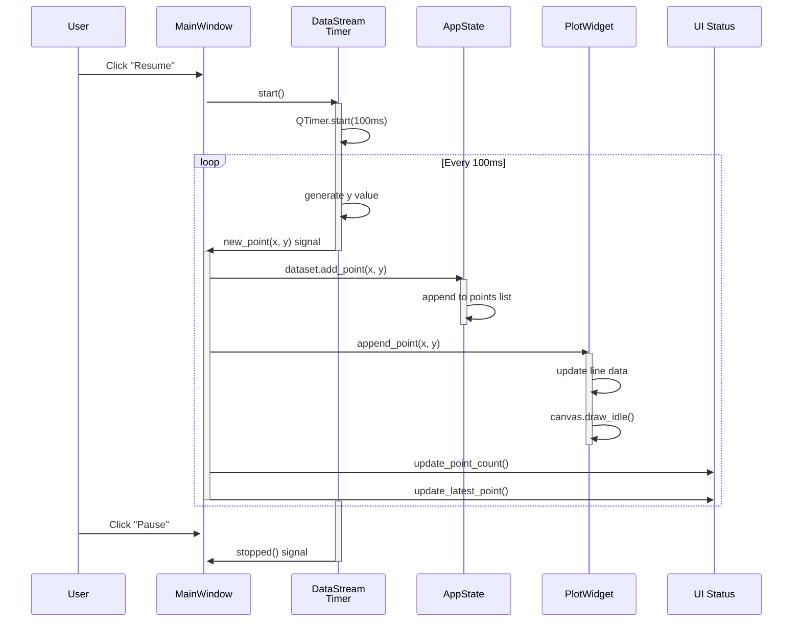
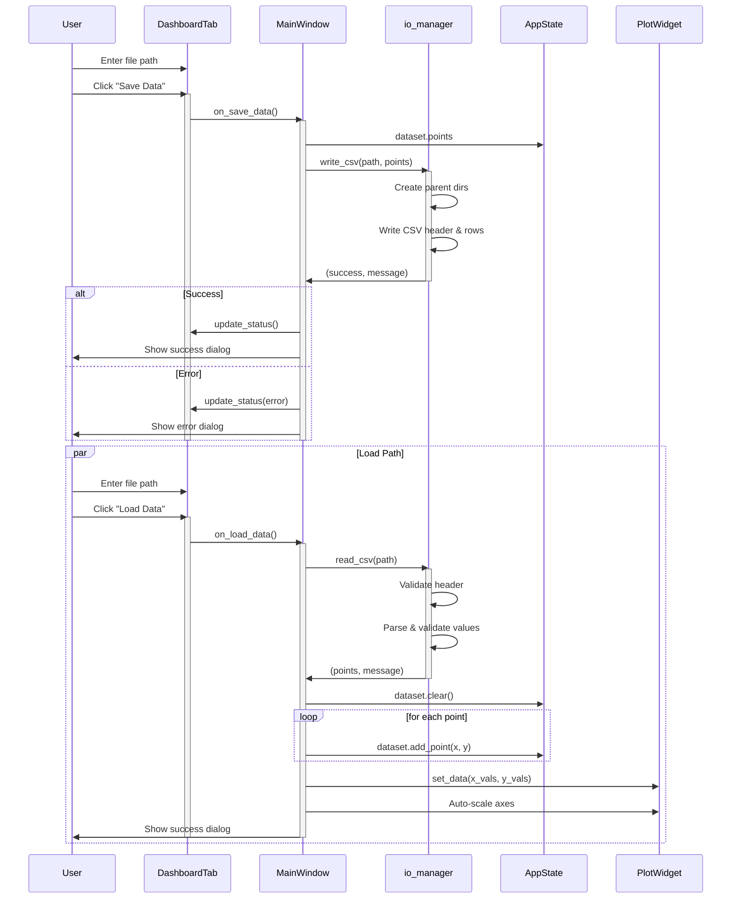

# Architecture & Design

## System Component Diagram



## Data Flow Sequence Diagram

### Real-Time Data Generation Loop



### Configuration Application Flow

```mermaid
sequenceDiagram
    participant User
    participant ConfigTab as ConfigTab
    participant MainWin as MainWindow
    participant ConfigM as ConfigModel
    participant AppState as AppState
    participant DataStream as DataStream
    
    User->>ConfigTab: Change amplitude value
    User->>ConfigTab: Click "Apply"
    activate ConfigTab
    ConfigTab->>ConfigM: get_config()
    activate ConfigM
    ConfigM->>ConfigM: validate()
    Note over ConfigM: Check bounds & types
    ConfigM->>ConfigTab: return ConfigModel
    deactivate ConfigM
    
    ConfigTab->>MainWin: on_apply_config(config)
    activate MainWin
    MainWin->>AppState: apply_config(config)
    activate AppState
    AppState->>ConfigM: validate()
    
    alt Valid
        AppState->>AppState: self.config = config
        AppState->>MainWin: return True
        deactivate AppState
        MainWin->>DataStream: set_config(config)
        MainWin->>User: Show success dialog
    else Invalid
        AppState->>MainWin: return False, error_msg
        deactivate AppState
        MainWin->>User: Show error dialog
    end
    deactivate MainWin
    deactivate ConfigTab
```

### Save/Load Data Flow



## Key Design Patterns

### 1. Signal/Slot Architecture

Qt's signal/slot mechanism decouples components:

```
DataStream (producer) 
  ↓ emits Signal
MainWindow (consumer, connects slot)
  ↓ processes
AppState, PlotWidget (updated)
```

**Benefits**:
- Loose coupling between components
- Automatic thread safety
- Intuitive event-driven flow

### 2. Model-View Separation

- **Models** (ConfigModel, DatasetModel): Pure data containers with validation
- **Views** (DashboardTab, ConfigTab): UI presentation, no business logic
- **Controller** (MainWindow): Wires models and views via signals

**Benefits**:
- Easy to test models independently
- UI can change without affecting data
- Multiple views of same data possible

### 3. State Management

`AppState` holds all application state in one place:
- Current configuration
- Active dataset
- Running/paused status

**Benefits**:
- Single source of truth
- Easy to serialize/persist state
- Simplifies undo/redo logic (future)

### 4. Composition Over Inheritance

```python
# Instead of: class Dashboard(QWidget, PlotMixin, ControlsMixin):

class DashboardTab(QWidget):
    def __init__(self):
        self.plot_widget = PlotWidget()  # ← Composition
        self.save_button = QPushButton()
```

**Benefits**:
- Simpler, more flexible
- Easier to test components independently
- Avoids diamond inheritance problems

### 5. Error Handling Pattern

Data operations return `(success: bool, message: str)` tuples:

```python
success, message = write_csv(path, points)
if success:
    # Handle success
else:
    # Handle error with user-friendly message
```

**Benefits**:
- Explicit error reporting
- Non-exception flow for recoverable errors
- Message ready for UI display

## Component Responsibilities

### `MainWindow`
- **Owns**: AppState, DataStream, UI tabs
- **Knows**: All slot handlers and signal connections
- **Does**: Coordinates between UI and logic

### `AppState`
- **Owns**: ConfigModel, DatasetModel, running flag
- **Knows**: Validation rules, state transitions
- **Does**: Holds and mutates state, NOT the UI

### `DataStream`
- **Owns**: Qt timer, current x position
- **Knows**: Waveform algorithms, noise generation
- **Does**: Generates points, emits signals

### `PlotWidget`
- **Owns**: Matplotlib Figure, Axes, Line
- **Knows**: How to render and update plots
- **Does**: Visualization only, no data processing

### `DashboardTab` / `ConfigTab`
- **Own**: UI widgets (buttons, text inputs, labels)
- **Know**: How to display data
- **Do**: Emit user intent as signals to MainWindow

### `io_manager`
- **Owns**: Nothing (pure functions)
- **Knows**: CSV format and validation rules
- **Does**: Read/write operations with error handling

## Data Consistency

### Immutability & Snapshots

When loading from CSV:

```python
points, message = read_csv(path)  # Returns new list
if points:
    app_state.dataset.clear()
    for x, y in points:
        app_state.dataset.add_point(x, y)
    plot_widget.set_data(x_vals, y_vals)
```

No shared references between modules; each component can safely work with its copy.

## Performance Considerations

### Efficient Plot Updates

```python
# Instead of full redraw each frame
plot_widget.append_point(x, y)  # Updates line data
plot_widget.canvas.draw_idle()  # Efficient update
```

This uses Matplotlib's `draw_idle()`, which throttles redraws to screen refresh rate (~60 Hz).

### Memory Management

DatasetModel automatically truncates old points:

```python
def add_point(self, x, y):
    self.points.append((x, y))
    if len(self.points) > self.max_length:
        self.points.pop(0)  # Remove oldest
```

With `max_length=5000`, memory usage stays bounded.

### Qt Event Loop

DataStream uses QTimer (not sleep loops) to avoid blocking:

```python
self.timer = QTimer()
self.timer.timeout.connect(self._on_timer)
self.timer.start(100)  # Callback every 100ms
```

This integrates with Qt's event loop for responsive UI.

## Extensibility

### Adding a New Waveform

1. Add to `ConfigModel.VALID_WAVEFORMS`
2. Add method to `DataStream`:
   ```python
   def _triangle_wave(self, x: float) -> float:
       # Implementation
   ```
3. Update switch in `_generate_y()`:
   ```python
   elif self.config.waveform == "triangle":
       base_y = self._triangle_wave(self.x_current)
   ```
4. Add test case in `test_data_stream.py`

### Adding a New Tab

1. Create `src/hello_gui/ui/newtab.py` with `NewTab(QWidget)`
2. In `main_window.py`:
   ```python
   self.new_tab = NewTab()
   self.tabs.addTab(self.new_tab, "New Tab")
   ```
3. Connect any signals in `_connect_signals()`

### Real Data Source Integration

Replace DataStream timer with:

```python
# Instead of synthetic data
class SensorStream(QObject):
    new_point = Signal(float, float)
    
    def __init__(self, sensor):
        self.sensor = sensor
        # Thread to read sensor data
        self.thread = SensorThread(sensor)
        self.thread.new_value.connect(self.new_point)
```

---

**Version**: 1.0  
**Last Updated**: December 2025
